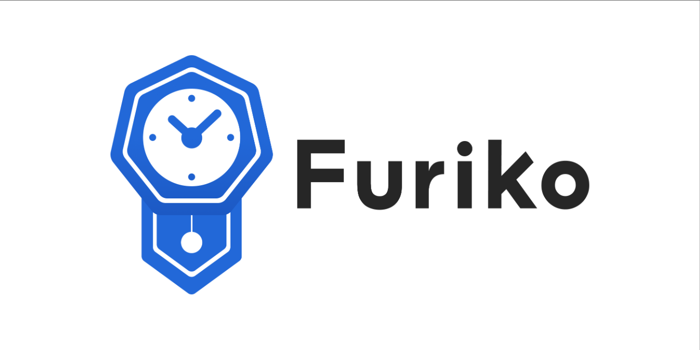

# Furiko

**Furiko** is a cloud-native, enterprise-level cron and adhoc job platform for Kubernetes.

The main website for documentation and updates is hosted at <https://furiko.io>.

## Introduction

Furiko is a Kubernetes-native operator for managing, scheduling and executing scheduled and adhoc jobs and workflows. It aims to be a general-purpose job platform that supports a diverse range of use cases, including cron jobs, batch processing, workflow automation, etc.

Furiko is built from the beginning to support enterprise-level use cases and running self-hosted in a private Kubernetes cluster, supporting users across a large organization.

## Features

Refer to the website for the full list of features: <https://furiko.io/docs/features>.

## Installing

For more information, refer to the official website: <https://furiko.io/docs/getting-started/install>

## Contributing

See [CONTRIBUTING.md](./CONTRIBUTING.md).

## License

Furiko is licensed under the [Apache License, Version 2.0](https://www.apache.org/licenses/LICENSE-2.0.txt).

Logo is designed by Duan Weiwei, and is distributed under [CC-BY 4.0](https://creativecommons.org/licenses/by/4.0/).
